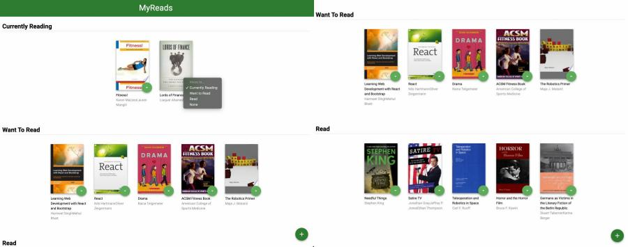
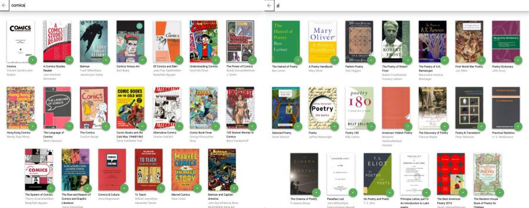

# MyReads BookShelf App

## About MyReads

The **MyReads App** allows the use to organize and move books between three different shelves.

- Currently Reading
- Want to Read
- Read

The fourth option, "None" allows the user to remove the book from the library. The user can add a book by selecting the button at the bottom of the page. This action will take the user to the app's search page. As the user types in the text for their book topic/title, search results will appear. This app uses the **BooksAPI (Udacity)**.

- The backend API uses a fixed set of cached search results and is limited to a particular set of search terms, which can be found in [SEARCH_TERMS.md](SEARCH_TERMS.md).
- That list of terms are the _only_ terms that will work with the backend, so don't be surprised if your searches for Basket Weaving or Bubble Wrap don't come back with any results.

## Organizing My App

First I needed to split the app into a component hierarchy. I needed to determine my components and subcomponents. I’m referred to [Thinking in React](https://reactjs.org/docs/thinking-in-react.html) as a guide. After reviewing the App.js file, organized my components: MainPage, SearchPage, Book, and Header.
Then I built a static version of my app with the UI. I referred to Maeve Nguyen's tutorial on how to organize the project. I had to convert from class components to functional components.

### MYREADS App

- App.js: includes MainPage and SearchPage
- Book: includes bookshelf changer
- MainPage: includes book and add book/open search button
- SearchBooks: page includes search input bar, search results, and close button; includes book

My App Hierarchy:

```
App.js
|-- Header
|-- MainPage.js
    |-- BookShelf.js
        |-- Book.js
|-- SearchPage.js
    |-- Book.js
```

### Screen Shots of App

#### MyReads Homepage



---

#### Book Search Page



---

### Working on My App

This was a tough app. Once I had an idea of how to organize the components and where the state would live, then I started coding. It took me awhile to get the shelf changer to work. I kept getting errors about "changeBookShelf" not being a function. I decided to redo that part and really focused on how I was sending the state from the App to the other child components. I finally got it. (05/09/2022: I thought I got it.)

### Why I Decided to Start Over

I decided to start over because I was getting confused with how I was passing my data between my components. I used Nguyen's approach of going back to the rubric and reviewing the project README notes about the BooksAPI. I found this to be helpful. You can view my notes here: [Starting Over](codenotes.md);

### What I Learned

### Helpful Resources

- [Maeva NGUYEN](https://www.youtube.com/watch?v=i6L2jLHV9j8)
- [Thinking in React](https://reactjs.org/docs/thinking-in-react.html)
- [Kenodipe](https://www.youtube.com/watch?v=DNdZ3-MiF1E&t=590s&ab_channel=kenjournal)

---

# Initiate the Project

To initiate this project complete the following steps:

- Install all project dependencies with `npm install`.
- Then run, `npm start` to display the application.

## Directory Hierarchy

```bash
├── CONTRIBUTING.md
├── README.md - This file.
├── SEARCH_TERMS.md # The whitelisted short collection of available search terms for you to use with your app.
├── package.json # npm package manager file. It's unlikely that you'll need to modify this.
├── public
│   ├── favicon.ico # React Icon, You may change if you wish.
│   └── index.html # DO NOT MODIFY
└── src
    ├── App.css # Styles for your app. Feel free to customize this as you desire.
    ├── App.js # This is the root of your app. Contains static HTML right now.
    ├── App.test.js # Used for testing. Provided with Create React App. Testing is encouraged, but not required.
    ├── BooksAPI.js # A JavaScript API for the provided Udacity backend. Instructions for the methods are below.
    ├── icons # Helpful images for your app. Use at your discretion.
    │   ├── add.svg
    │   ├── arrow-back.svg
    │   └── arrow-drop-down.svg
    ├── index.css # Global styles. You probably won't need to change anything here.
    └── index.js # You should not need to modify this file. It is used for DOM rendering only.
```

## Backend Server

To simplify your development process, we've provided a backend server for you to develop against. The provided file [`BooksAPI.js`](src/BooksAPI.js) contains the methods you will need to perform necessary operations on the backend:

- [`getAll`](#getall)
- [`update`](#update)
- [`search`](#search)
